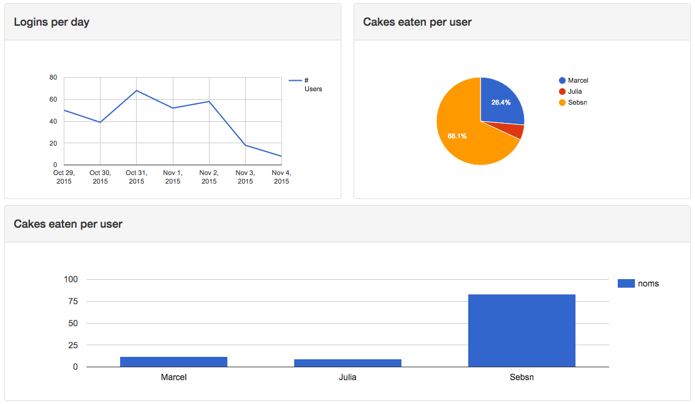
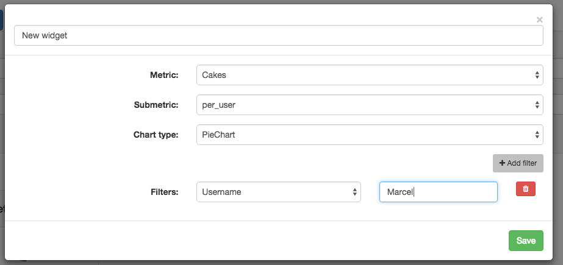

# Cockpit
## Custom widgets for your Laravel app


[](https://codecov.io/github/mpociot/cockpit?branch=master)
[](https://scrutinizer-ci.com/g/mpociot/cockpit/?branch=master)
[](https://travis-ci.org/mpociot/cockpit)



Easy to use widgets with custom metrics, filters and drag and drop support.

## Contents

- [Installation](#installation)
- [Usage](#usage)
    - [Custom metrics](#metrics)
    - [How does it work?](#how-it-works)
    - [Custom filters](#filters)
    - [Available chart types](#chart-types)
- [License](#license) 

<a name="installation" />
## Installation

In order to install Cockpit, just add 

    "mpociot/cockpit": "~1.0"

to your composer.json. Then run `composer install` or `composer update`.

(or run `composer require mpociot/cockpit` if you prefere that)

Then in your `config/app.php` add 

    Mpociot\Cockpit\CockpitServiceProvider::class
    
in the `providers` array.

Next, publish Cockpit's views, javascript files and migration and run the migrate command.

```bash
php artisan vendor:publish --provider="Mpociot\Cockpit\CockpitServiceProvider"
php artisan migrate
```

<a name="usage" />
## Usage

After you've published all the needed assets and created the `widgets` table through the Cockpit migration, you're good to go.

Cockpit comes with some preconfigured routes, so go ahead and visit: `http://your.app/cockpit/`.

This is your "dashboard" which allows you to create custom widgets that will query your application and show some nice charts.

<a name="how-it-works" />
### How does it work?

When you add a new widget, Cockpit will look in a configurable folder for all available metrics your app could define. 
Each metric can have multiple sub-metrics that can be queried and those sub-metrics are filterable.

Example to make the concept easier to understand:

Your app logs all logins. 
On your dashboard, you want to be able to show a widget that displays:

- All logins grouped by "time" (this could be day, week, month, year)
- All logins grouped by specific users

In this case, your metric would be `Logins` that has two submetrics named `per_time` and `per_user`.

<a name="metrics" />
### Custom metrics



Cockpit ships a simple `Users` metric, which will be copied to this directory: `app/Cockpit/Metrics`.
If your app is running in a different namespace or you want to change the path of your custom metrics, modify the appropriate values in the `config/cockpit.php` file.

The base structure of a metric is:

```php
use Mpociot\Cockpit\Metric;

class Logins extends Metric
{
	// Visible name when selecting the metric in the UI
	protected $name = "My Metric";
	
	// Define all submetrics and which charts are available for each submetric
	protected $allowedSubMetrics = [
        'per_user' => ['LineChart','ColumnChart','PieChart'],
    ];

    // Define all filters that can be applied to this metric
    protected $allowedFilters = [
        'username' => [
            'type' => 'text',
            'name' => 'Username'
        ]
    ];
	
	/**
	 * Implement date filter functionality.
	 * This is needed for all metrics, as the time filter is always available
	 */
    protected function filterFromDate($query, $value)
    {
        return $query->where("created_at" , ">", $value);
    }

    protected function filterUntilDate($query, $value)
    {
        return $query->where("created_at" , "<=", $value);
    }
    
    /**
     * Implement your custom submetrics
     */
     public function calculatePerUser($filters = [])
    {
		// Use this Eloquent model for all queries
        $query = \App\Models\Login::query();
        
		// Apply each filter method on the query object
        $query = $this->applyFilters($query, $filters);

		// Get the results we need to display
        $results = $query
	        ->groupBy("username")
	        ->get([
                DB::raw('username, COUNT(*) AS `count`')
            ]);
		
		// Define the columns our chart will have
        $this->dataTable
        		->addStringColumn("Username")
            	->addNumberColumn("Num Logins");

		// Add the database results to our chart
        foreach ($results as $result) {
            $this->dataTable->addRow([
           	   $result->username,
                $result->count
            ]);
        }

        return $this->dataTable;
    }
     
     /**
     * Implement your custom filters
     */
	protected function filterUsername($query, $value)
    {
        return $query->where("username",$value);
    }
     
}
```

<a name="filters" />
### Custom filters

Not documented yet :(

<a name="chart-types" />
### Available chart types

- Line Chart
- Area Chart
- Bar Chart
- Column Chart
- Pie Chart
- Donut Chart
- Geo Chart
- Calendar Chart
- Gauge Chart

For further information about how the DataTable API / Chart API works, please take a look at [Lavacharts](http://lavacharts.com/).

<a name="license" />
## License

cockpit is free software distributed under the terms of the MIT license.